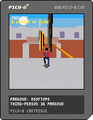
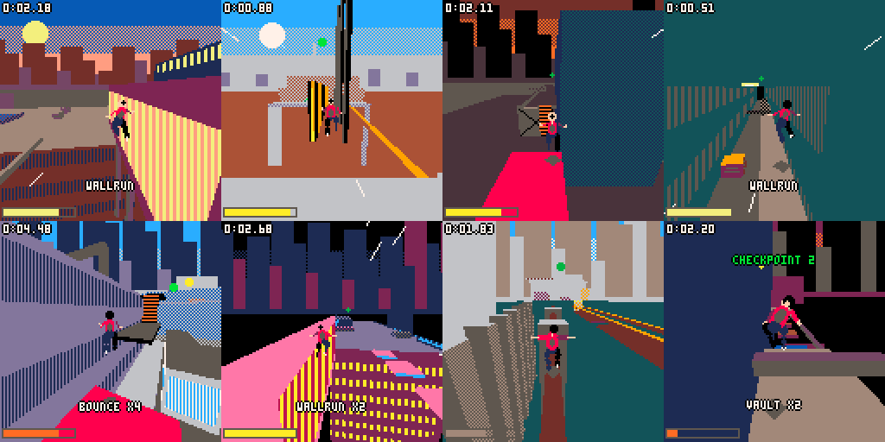
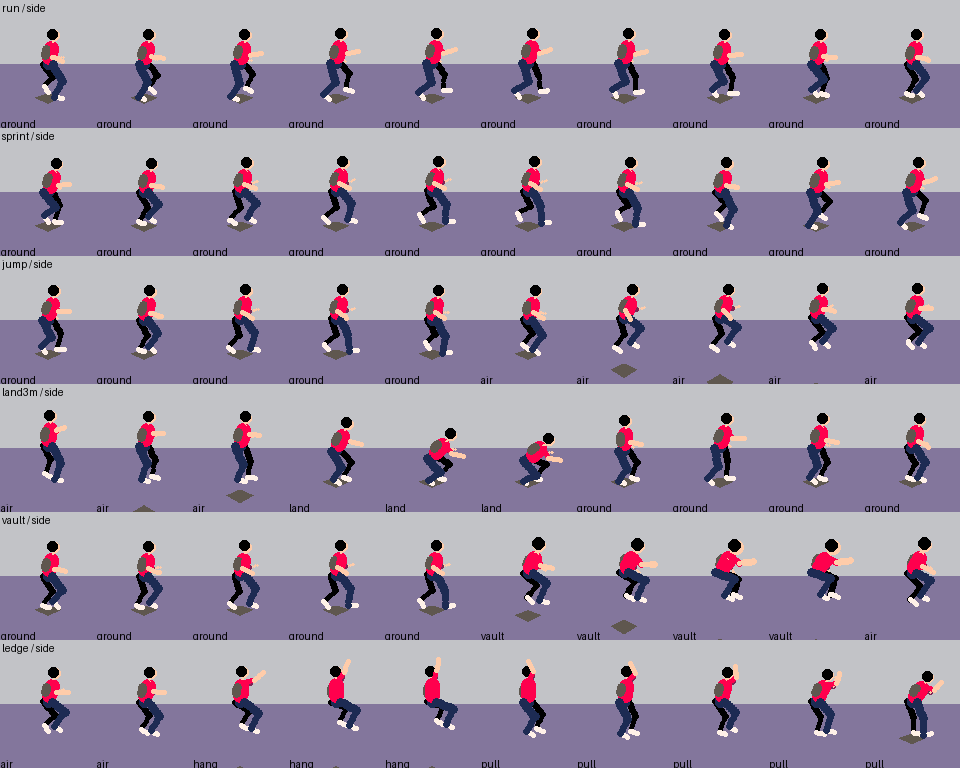

# PARKOUR

3D-игра от третьего лица для PICO-8, в которой весь геймплей — паркур.
Ни оружия, ни врагов, ни монеток: только движение, инерция и маршруты.
Восемь уровней, каждый со своей архитектурой, палитрой, темпом и
набором препятствий; почти каждую крупную секцию можно пройти двумя-тремя
способами.





*Восемь уровней: старый город, стройка, завод, метро, даунтаун, неоновый
район, горная деревня, мегаструктура.*


*Экспертный маршрут первого уровня целиком (автопилот в эмуляторе, ~42 с).*



*Анимация сбоку (тестовая площадка `tools/animtest.py`): бег, спринт,
прыжок, приземление с 3 м, vault, захват карниза и подъём.*

## Запуск

* PICO-8: `load parkour.p8` (или `parkour.p8.png`) → `run`.
* Картридж собирается из исходников: `python3 tools/build.py`.
* На титульном экране ⬅️➡️ выбирают уровень; следующий открывается, когда
  у текущего есть лучшее время. После финиша 🅾️ — следующий уровень,
  ❎ — заново. В меню паузы: рестарт уровня, последний чекпоинт, выбор уровня,
  **perf overlay** (FPS, загрузка CPU и число коллизионных боксов рядом с
  бегуном в левом верхнем углу).
* В `parkour.p8` лежит минифицированный код (пробелы и комментарии убраны
  shrinko8, имена сохранены); читаемые исходники — в `src/`.

## Управление

| Кнопка | Действие |
|---|---|
| ⬆️ | бег (держать — разгон) |
| ⬇️ | торможение |
| ⬅️ ➡️ | поворот; на балке — удержание равновесия; на карнизе — перемещение вдоль края |
| 🅾️ (Z) | прыжок; **держать** у стены — wall run / забег на стену; **нажать** на стене — оттолкнуться (tic-tac / wall jump); на карнизе — подтянуться |
| ❎ (X) | подкат на скорости / присед; **перед приземлением** — перекат; на карнизе/лестнице — отпустить |
| ⬇️ + 🅾️ | на карнизе или лестнице — прыжок назад от стены |

Контекстные действия предсказуемы: vault и захват карниза происходят
автоматически только при движении *в* препятствие; стены используются
только пока зажата 🅾️; карабкаться можно только по жёлтым объектам
(лестницы, трубы, жёлтая скала). Навесы, страховочные сетки и батуты
подбрасывают.

## Система движения

| Механика | Как работает |
|---|---|
| Бег | ускорение/торможение/инерция; walk → run → sprint. Максимальная скорость растёт вместе с **flow** (6.2 → 9 м/с) |
| Прыжок | высота и дальность зависят от скорости; прыжок у самого края даёт **edge jump** (+8%); с балки — ниже, с подката/переката — ниже, с навеса — выше |
| Precision jump | прыжок с места/с шага — фиксированный короткий прыжок (~2 м) для точных приземлений; приземление на узкое гасит скорость |
| Vault | 3 варианта по скорости: *climb over* (медленно), *vault*, *speed vault* (сохраняет и чуть добавляет скорость). Высокие препятствия нельзя speed-vault'ить |
| Mantle | не долетел до края (до 1.3 м выше ног) — автоматическое забрасывание наверх без остановки |
| Ledge grab / Cat leap | край выше — вис; при быстром подлёте — cat leap (быстрее подтягивание). Подтянуться, отпрыгнуть назад, перемещаться вдоль края, спрыгнуть |
| Wall run | зажать 🅾️ вдоль стены; длительность и подъём зависят от скорости входа, гравитация нарастает — бесконечно бегать нельзя; повторно по той же стене нельзя |
| Wall jump | 🅾️ во время wall run: сохраняет скорость вдоль стены; можно чередовать wall run → wall jump → wall run |
| Wall climb | зажать 🅾️ лицом в стену: забег вверх (~4 м с разбега), затем захват/mantle |
| Tic-tac | нажать 🅾️ при касании стены в воздухе — отталкивание с изменением траектории; каждое следующее без приземления слабее |
| Slide | ❎ на скорости: проскальзывание под трубами, медленно теряет скорость, переходит обратно в бег; прыжок из подката (только если над головой есть место) |
| Safety roll | ❎ перед приземлением с высоты: сохраняет скорость, без оглушения (до ~11 м) |
| Hard landing | без переката с высоты: потеря скорости, короткий stun, «тяжёлое» движение, лёгкая реакция камеры. Здоровья нет — ошибка ломает flow |
| Climb | лестницы, трубы, жёлтая скала: вверх/вниз, прыжок назад, отпустить |
| Balance | узкие балки/трубы/тросы: ⬅️➡️ компенсируют раскачку; на скорости раскачка сильнее; при потере равновесия — срыв (можно поймать край) |
| Bounce | навесы, страховочные сетки и батуты подбрасывают на 3–4 м (выше, если держать 🅾️) |

### Flow

Хорошо выполненные движения (vault, wall run, roll, точные приземления,
edge jump…) и долгий бег на скорости наполняют **flow** — он поднимает
максимальную скорость. Ошибки (удар о стену, жёсткое приземление, срыв
с балки, остановка) рвут цепочку и сбрасывают flow. Внизу слева — шкала
скорости, её цвет показывает flow. Очки и цепочка (`vault x6`)
показываются ненавязчиво, на них можно не смотреть.

### Time trial

Таймер идёт с первого нажатия. Для каждого уровня сохраняются лучшее
время и сплиты по чекпоинтам (`cartdata`); на чекпоинте показывается
разница со сплитом лучшего забега. Маячок над следующим чекпоинтом
виден сквозь стены. Падение вниз — мгновенный рестарт с последнего
чекпоинта.

## Бегун и камера

Персонаж — маленькая объёмная фигура из капсул: голова с волосами, торс
и рюкзак, таз, бёдра и голени, плечи и предплечья, ступни в белых
кроссовках. Ближние к камере конечности окрашены иначе, чем дальние,
поэтому направление тела читается с любого угла.

* **Две ноги видны всегда**: ноги разведены по ширине таза, а на экране
  принудительно держится минимальный зазор между суставами ног (если
  проекция сводит ноги в одну линию — их раздвигают).
* Камера выше и позади, смотрит вниз под углом: видно обе ноги, руки,
  корпус, направление движения и поверхность впереди. Дистанция растёт
  со скоростью, есть упреждение по направлению бега и защита от стен.
  Камера не крутится вместе с телом (кувырок вращает только бегуна).

### Анимация

Анимация процедурная: поза — 14 параметров (наклон вперёд и вбок,
высота таза, цели обеих лодыжек, плечо и локоть каждой руки, разведение
рук, сдвиг стоп, тангаж тела), которые плавно тянутся к целевой позе
состояния; ни одна анимация не задерживает ввод и не влияет на физику.

* **Ноги — двухзвенная IK** (бедро 0.45 м, голень 0.43 м) от таза к цели
  лодыжки: колено всегда сгибается вперёд и никогда не выворачивается,
  стопа ставится плоско, перпендикулярно голени.
* **Цикл бега строится из скорости**: каденс `1.1 + 0.13·v` шагов в
  секунду, доля опоры и длина шага выводятся так, что опорная стопа едет
  назад ровно со скоростью тела — **стопа стоит на месте**, не скользит.
  Фазы: контакт → амортизация (таз ниже всего в середине опоры) →
  проход → толчок → полёт (таз по баллистике, пятка подтягивается к
  ягодице, нога выносится вперёд низко и подтягивается в контакт). Шаг,
  высота подъёма стопы и подпрыгивание таза растут от ходьбы к спринту;
  стоя — только едва заметное дыхание.
* **Таз и корпус**: таз смещается к опорной ноге и поворачивается с
  шагом; корпус наклоняется вперёд со скоростью, сильнее при разгоне,
  выпрямляется при торможении; в поворотах тело догоняет направление
  движения с запаздыванием и наклоняется внутрь поворота (сильнее на
  скорости).
* **Руки** — плечо и предплечье с согнутым локтем, в противофазе ногам,
  размах меньше, чем у ног.
* **Прыжок**: толчок → группировка → вынос ног к земле перед
  приземлением. **Приземление** зависит от скорости падения: чем жёстче,
  тем глубже приседают колени, затем мягко выпрямляются.
* **Vault**: три фазы — рука на препятствие и корпус вперёд, таз над
  препятствием со сдвигом вбок, ноги проносятся следом.
* **Wall run**: наклон к стене, стопы ставятся на стену, руки разведены
  для баланса (это не «повёрнутый бег»). **Wall jump**: толчок ногами от
  стены, корпус разворачивается за новым направлением постепенно.
* **Карниз**: руки на краю, тело висит (с ногами на стене, если она
  есть); **подъём**: руки давят вниз, таз проходит над краем, колено
  ставится на карниз. Лестницы — попеременно руки и ноги.
* **Подкат**: низко, одна нога вытянута, другая согнута, рука для
  баланса. **Кувырок**: группировка и вращение тела вокруг таза.
  **Баланс** на узких балках: руки в стороны, корпус качается.

`python3 tools/animtest.py` строит тестовую площадку (ровный пол, бокс
1 м для vault, стена для wall run, карниз 2.5 м), проигрывает каждое
движение и сохраняет раскадровки сзади, сбоку и под углом, а также
меряет скольжение стоп: при беге 6.6 м/с опорная стопа движется в
среднем на ~1.2 м/с (≈0.02 м за кадр опоры), при спринте 9 м/с — ~1.35 м/с.

## Уровни

| # | Уровень | Характер | Что в нём главное |
|---|---|---|---|
| 1 | **Old City Rooftops** | закат, кирпич, трубы, бельевые верёвки | FLOW: короткие комбо — vault, переулки, захваты, короткие wall run; вводный |
| 2 | **Construction Site** | бетон, оранжевые балки, краны, страховочные сетки | вертикаль: этаж за этажом, точность, баланс на балке, wall run по щиту, проход по стреле крана на 34 м |
| 3 | **Factory** | ржавчина, смог, контейнеры, трубы | MOMENTUM: длинные прямые, спринт по галерее → контейнеры → wall run по резервуару → трубная эстакада → прыжок над шлаковой ямой |
| 4 | **Underground** | метро, кафель, световые полосы, темнота | тесно и точно: платформа → тоннель → служебный мостик → верхний тоннель; подкаты, vault, зигзаг wall run между стенами тоннеля |
| 5 | **Downtown** | стекло, витрины, рекламные щиты, парковка | улица → такси → фургон → навес → балкон → пожарная лестница → крыша → трос → соседнее здание → паркинг → башня с уступами |
| 6 | **Neon District** | ночь, неон, светящиеся кромки крыш | СКОРОСТЬ: нисходящая линия крыш, длинные wall run по билбордам, большие разрывы, эстакада с поездом; хороший игрок почти не останавливается |
| 7 | **Cliff Village** | скалы, белые домики, мосты, верёвки | точность и вертикаль над долиной: обрывистые падения, балки между шпилями, cat leap по выступам, лазание по жёлтой скале |
| 8 | **Megastructure** | гигантская промышленная башня, реакторная яма | ВСЁ сразу: подъём серпантином с самого низа (y 2) на вершину ядра (y 42), каждая механика игры |

У каждого уровня свой маршрут flow, своя палитра (отображаемая палитра
перекрашивается через секретные цвета PICO-8), небо, туман и подсказки.

### Маршруты по секциям

**1. Old City** (7 чекпоинтов)

| Секция | Безопасно | Сложнее | Эксперт |
|---|---|---|---|
| R2 → R3 (4 м стена) | жёлтая лестница | ящик → будка → два mantle | прыжок + забег на стену |
| R3 → R4 (6 м пропасть) | спуск на низкую крышу | балансирование по трубе | wall run по билборду |
| R4 → R6 | пожарная лестница вниз, водосток вверх | навес → балкон → крыша | с полным flow — прыжок через 6 м и забег на стену |
| R8 → R9 (бульвар 13 м) | крытый мост в обход | трос (баланс 13 м) | wall run → wall jump → wall run между билбордами |
| R9 → башня | лестница → площадка → лестница | захват дымохода | vault → mantle → mantle |

**2. Construction Site** — каждый подъём на 4 м: лестница | паллеты/ящики/
висящий паллет | забег на опалубку. Разрыв 20 м между башнями: прыжки по
висящим паллетам | балка (баланс) | wall run по щиту. Вторая башня —
ступенчатые перекрытия: лестница | отскок от страховочной сетки | забег на
стену. Финал — лестница по мачте крана и проход по стреле к кабине.

**3. Factory** — склад: нижняя линия с препятствиями | спринт-галерея на
высоте 6 м. Двор: обход по земле | одиночные контейнеры | двойные штабеля
с разрывами 4 м. Резервуары: лестница на эстакаду | wall run по
резервуару. Шлаковая яма: доска + лестница | контейнер на крюке |
длинный прыжок на полном flow. Силос: лестница | ящик | забег на стену.

**4. Underground** — станция: платформа | крыша поезда | пути. Тоннель:
служебный мостик с разрывами и кабелем | пути с сигнальным шкафом и
трубой | зигзаг wall run. Подъём на 7 м: лестница | цепочка ящиков | забег
с ящика. Верхний тоннель: подкат под коробом, яма, балки над шахтой.
Выход: турникеты и лестница на улицу.

**5. Downtown** — улица: пожарная лестница сразу у старта | такси →
фургон → отскок от навеса → балкон → лестница | припаркованная машина →
низкий навес → крыши магазинов. Перекрёсток: крыша скайбриджа | трос |
козырёк следующего здания (лестница, кондиционер, забег). Крыша офиса —
площадка-«playground». Паркинг: между машинами или по их крышам. Башня с
тремя уступами по 4 м: лестницы | люльки мойщиков и кондиционеры | забег
на стену.

**6. Neon District** — старт на 24 м: speed vault, подкат, прыжок
вниз (или висящая вывеска-мост). Проулок 14 м: wall run по билборду |
неоновые буквы | балка. Отскок от навеса бара на высокую крышу.
Разрыв 9 м: прыжок на полном flow | с высокой крыши с перекатом |
висящие вывески. Эстакада: спринт по путям | wall run вдоль поезда | бег
по крыше поезда. Финал: прыжок с крыши поезда на башню | забеги по
световому блоку | лестницы.

**7. Cliff Village** — ущелье: мост с верёвочными перилами | верёвка |
прыжок с крыши дома на дальний дом. Скала 12 м: зигзаг лестниц по
полкам | жёлтая трещина в скале | выступы с захватами. Пропасть: мост с
провалом | балки между скальными шпилями | прыжки по каменным столбам.
Деревня террасами: лестницы | ящик и захваты | забеги на стены. Вершина:
длинная лестница | забег на уступ и на вершину.

**8. Megastructure** — четыре галереи вдоль ядра, каждая на 8 м выше
предыдущей, чередуют стороны. Каждый подъём: лестницы | цепочка
контейнеров или висящих грузов | двойной забег через машинный блок.
Галереи: vault, подкаты, батут, разрывы — wall run по щиту или по ядру |
прыжки по плитам | труба (баланс). Галереи не перекрываются в плане,
поэтому падение уходит в реакторную яму и возвращает на чекпоинт.
Финал — спринт по вершине ядра.

## Архитектура

Код разбит на вкладки PICO-8 (`src/*.lua`, порядок в `tools/build.py`):

| Модуль | Ответственность |
|---|---|
| `main` | игровой цикл (30 fps: на кадр два фиксированных шага физики по 1/60 с), режимы (title/play/done), выбор уровня, ввод, чекпоинты, таймер, сплиты, HUD, подсказки, perf overlay |
| `level` | загрузка уровня из памяти картриджа: палитра, небо, материалы, боксы |
| `collide` | ближние боксы, AABB-коллизии по осям (выталкивание на сторону, откуда пришёл центр), ступеньки |
| `parkour` | детекция (vault, карниз, узкие поверхности), запуск движений, flow/очки |
| `player` | физика и **state machine**: `ground` (бег/присед/баланс), `air`, `vault`, `slide`, `roll`, `land`, `wallrun`, `wallup`, `hang`, `pull`, `climb` |
| `anim` | процедурная анимация: позы, цикл бега из скорости, IK ног, сглаживание, отрисовка бегуна капсулами, гарантия двух видимых ног |
| `camera` | камера с запаздыванием, упреждением, дистанцией от скорости, коллизией штанги |
| `render` | отбор видимых боксов (дистанция тумана, отбраковка позади камеры, экранная рамка), дальние боксы — плоские силуэты в цвете тумана, топологическая сортировка художника (DFS по парам с пересекающимися экранными рамками и точным компаратором разделяющих плоскостей), клиппинг по near plane, заливка полигонов, туман, детали фасадов (окна, рекламы, лестницы, решётки), небо с силуэтами, маячок чекпоинта |
| `fx` | линии скорости |

### Данные уровней

Геометрия не тратит токены кода. Уровни описаны на Python в
`tools/levels/l1_oldcity.py` … `l8_mega.py` (общие помощники и
материалы — `tools/levels/common.py`) и упаковываются `build.py` в
неиспользуемую память картриджа: gfx + map + флаги спрайтов и свободные
слоты sfx (19–63). Блок уровня: 16 байт палитры, 11 байт неба (цвета,
туман, дальность, база подсказок, направление старта, высота силуэтов),
15 материалов × 4 байта, затем боксы по 10 байт (координаты ×8, размеры
×4, материал + аргумент). 8 уровней — 786 боксов, ~8.6 КБ из ~15.6 КБ.

Бюджет кода: **8135 / 8192** токенов, 11.6k / 15.6k сжатого (код в
картридже минифицирован).

## Инструменты (`tools/`)

* `build.py` — собирает `parkour.p8` (код, 8 уровней, звуки, музыка, лейбл)
  и минифицирует код через shrinko8 (если он лежит в `/tmp/shrinko8`).
* `sim.py` — headless-эмуляция PICO-8 API на Lua 5.4 (lupa): кадры, ввод,
  скриншоты с отображаемой палитрой, подсчёт инструкций.
* `perf.py` — отчёт о производительности по уровням (полная версия perf
  overlay): инструкции на отрисовку и физику, боксы, полигоны, строки
  заливки, коллизионные боксы; `--busy` — без деталей фасадов.
* `animtest.py` — тестовая площадка анимации: раскадровки каждого
  движения с трёх ракурсов и замер скольжения стоп.
* `playtest.py` — **137 сценариев**: каждая механика и каждый маршрут всех
  8 уровней (`tools/tests/l2.py` … `l8.py`, сценарии уровня 1 — в самом
  `playtest.py`). Помощники ввода: прыжок у края, прыжок после
  приземления, подкат перед трубой, перекат, баланс.
* `bot.py` — автопилот проходит уровень 1 целиком (safe/expert), `--gif`.
* `fuzz.py` — случайный ввод со всех чекпоинтов всех уровней: ошибки Lua,
  NaN, зависшие состояния, застревание в геометрии (`SEED=n`).
* `levelmap.py` — карта уровня сверху (PNG).
* `make_label.py` — лейбл картриджа.

```
pip install lupa pillow
git clone https://github.com/thisismypassport/shrinko8 /tmp/shrinko8   # шрифт/палитра для скриншотов, подсчёт токенов
python3 tools/build.py && python3 tools/playtest.py && python3 tools/fuzz.py
python3 /tmp/shrinko8/shrinko8.py parkour.p8 --count
python3 /tmp/shrinko8/shrinko8.py parkour.p8 parkour.p8.png
```

## Производительность

Игра идёт на стабильных **30 fps**: `_update` вызывается 30 раз в
секунду и делает два фиксированных шага физики по 1/60 с, поэтому
физика, тайминги прыжков и маршрутов не зависят от того, сколько
длится отрисовка (все сценарии проходят с прежними таймингами).

* **Отбор видимого**: дистанция ограничена туманом уровня (14 м в метро …
  32 м в неоне); за ней ещё 14 м дальние боксы рисуются одним плоским
  прямоугольником цвета тумана — без сортировки и полигонов, поэтому
  объекты не «выпрыгивают», а проявляются из тумана. Боксы целиком
  позади камеры и вне экрана отбрасываются до проекции.
* **Кэш вершин**: 8 углов бокса переводятся в пространство камеры и
  проецируются один раз за кадр; грани, клиппинг и детали фасадов
  берут готовые экранные точки.
* **Backface culling**: рисуются только грани, к которым камера
  обращена (не больше трёх на бокс).
* **Сортировка**: только видимые боксы, сначала по дистанции (вставками
  — порядок почти не меняется между кадрами), затем DFS по парам с
  пересекающимися экранными рамками.
* **Детали фасадов** рисуются, пока есть запас CPU (`stat(1)<0.9`), и
  никогда — в тумане.
* **Коллизии отделены от графики**: физика проверяет только боксы в
  радиусе 8 м от бегуна (список обновляется при движении), паркур-детекция
  — тот же короткий список.
* **Бегун** — 16 капсул (цепочки кругов), без полигонов и граней.

Худший кадр на уровень в эмуляторе (`tools/perf.py`, инструкций Lua на
30-кадр, включая два шага физики; эмулированные встроенные функции
дороже настоящих), с деталями фасадов / без них:

| Уровень | с деталями | без деталей | боксов в сортировке |
|---|---|---|---|
| 1 Старый город | 199k | 144k | 19 |
| 2 Стройка | 232k | 212k | 31 |
| 3 Завод | 120k | 104k | 16 |
| 4 Метро | 229k | 187k | 28 |
| 5 Даунтаун | 199k | 170k | 20–27 |
| 6 Неон | 156k | 119k | 16 |
| 7 Деревня | 185k | 160k | 24 |
| 8 Мегаструктура | 167k | 138k | 18 |

По сравнению с прежней версией (60 fps, полная проекция и сортировка)
работа в секунду упала в 2.4–3.3 раза (стройка: 19.8M → 6.7M инструкций/с).

## Ограничения

* Игра тестировалась в эмуляторе (`tools/sim.py`), а не в самом PICO-8:
  синтаксис и бюджет проверены shrinko8, механики и маршруты —
  сценариями, ботом и фаззером. Бюджет CPU настоящего PICO-8 оценён по
  числу инструкций, а не измерен; самый тяжёлый вид — стройка через
  весь пролёт.
* Токенов почти не осталось (57): новые механики потребуют сжатия кода.
